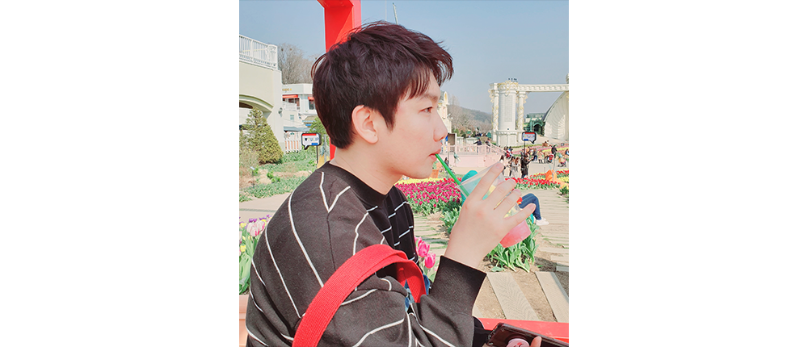

### 소개
조용구 | 프런트 엔지니어

이해하기 쉬운 코드와 아키텍처에 관심이 많아 리팩토링하는 것을 즐깁니다.
그리고 효율적인 개발과 커뮤니케이션으로 업무 효율을 끌어올리는 것을 자주 고민합니다.

### 경력
- 카카오 | FE플램폼팀 | 2018.02.19~재직중
- 한화테크윈 | Web SW팀 | 2016.01.01~2018.01.29
- 삼성테크윈 | 선행개발연구소 | 2013.01.29~2015.12.31

### 주요 프로젝트
- 카카오
    - [카카오톡 비즈니스폼](https://business.kakao.com/talkbizform/)
        - TS, Vue Composition API
    - [kakao i open builder](https://i.kakao.com/)
        - TS, Angular, RxJs
    - 카카오톡 영화예매 서비스
        - ES6, Vue, Vuex, Vue SSR, Mocha
- 한화테크윈
    - B2B CCTV 웹뷰어 플랫폼 구축
        - AngularJs, less
        - WN5 관련 UI 개편
        - 셋업/VA 기능 프런트 담당
        - WebViewer UI 개발 리더
        - 프런트 엔드 테크니컬 리더
- 삼성테크윈
    - 전사 웹 프레임워크 개발
        - AngularJs, nodeJs 기반
    - PnP 2.0 Mobile: 칩마운터 장비 모니터링 하이브리드 앱 개발
        - Cordova 기반

### 수상
- 2019.04 제주도 기능경기대회 심사위원 위촉 | 제주도특별자치도 기능경기위원회
- 2015.12 브라질국제기능올림픽 국가대표 지도교사 표창장 | 고용노동부장관 표창장
- 2013.12 동탑산업훈장 | 행정안전부
- 2013.07 제 42회 독일국제기능올림픽 금메달 & 국가 MVP | WorldSkills International
- 2011.09 제 46회 전국기능경기대회 은메달 | 국제기능올림픽대회 한국위원회
- 2011.04 충청북도 기능경기대회 금메달 | 충청북도기능경기위원회
